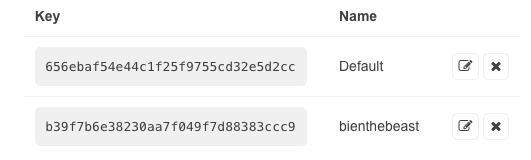
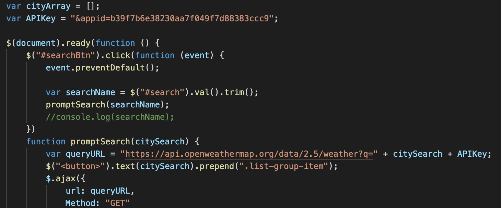

# weather-dashboard

## HTML
First I started off using bootstrap to style my page and to add content

## API KEY
I generated my own API Key from Open Weather

## AJAX
And then I went ahead and linked my scripts to open weather database using ajax
* I also started with some javascript events such as creating a button that pulls the city name

## Javascript
From there I started to create function that pulls the information needed for the weather dashboard
* Temperature
* Humidity
* Wind Speend
* UV Index

## Built With
* [HTML](https://developer.mozilla.org/en-US/docs/Web/HTML)
* [CSS](https://developer.mozilla.org/en-US/docs/Web/CSS)
* [Bootstrap](https://getbootstrap.com/docs/4.5/components/alerts/)
* [jQueary](https://jquery.com/)
* [W33School](https://www.w3schools.com/)
* [moments.js](https://momentjs.com/)
* [API-Keys](https://openweathermap.org/api)

## Deployed Link
* [About-Me](https://biencarlovilla.github.io/weather-dashboard/)

## Author
* Biencarlo Villa
